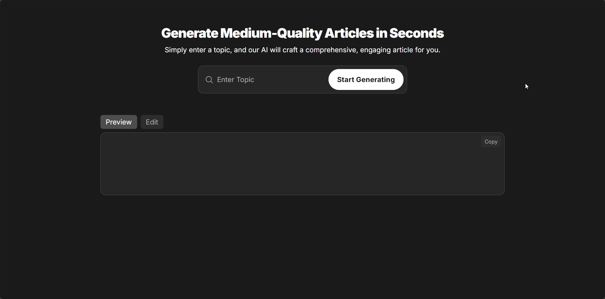
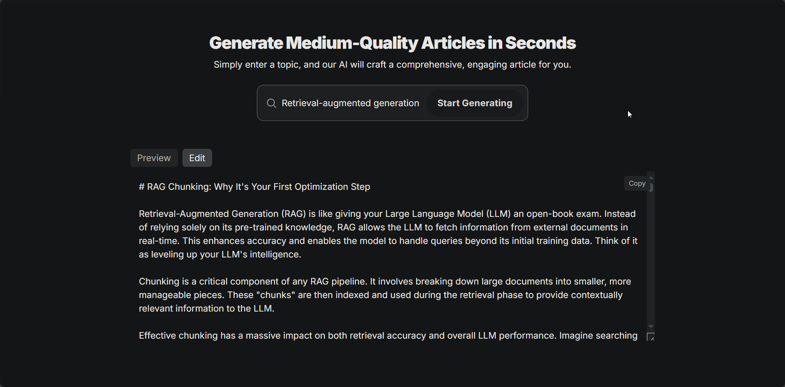

# ArticleWriterAgent — AI-Powered Article Writing Agents

A lightweight Flask app that orchestrates CrewAI agents to research, outline, and write polished, markdown-formatted articles from a single topic. ✨🛠️

## Table of Contents
- **[Demo](#demo)**
- **[Features](#features)**
- **[Installation / Setup](#installation--setup)**
- **[Usage](#usage)**
- **[Configuration / Options](#configuration--options)**
- **[Contributing](#contributing)**
- **[License](#license)**
- **[Acknowledgements / Credits](#acknowledgements--credits)**

## Demo
Real demo assets are available under `./demo/`:

- Screenshot 1:
  
  

- Screenshot 2:
  
  

- Video walkthrough:
  
  <video src="./demo/demo.mp4" controls width="720"></video>

## Features
- **CrewAI multi-agent workflow**: orchestrates style decision, structure design, web search/scrape, and article writing using `crewai`.
- **Web research tools**: Serper-based search + BeautifulSoup scraping via tools in `tools/web_tools.py`.
- **Two UIs**:
  - `Flask` minimal web endpoint at `app.py` that returns generated article JSON.
  - `Streamlit` rich UI at `ui/main.py` for interactive generation and download.
- **Typed schemas**: `pydantic` models in `schemas/agents_schemas.py` define inputs/outputs for each stage.
- **Configurable LLM & keys**: `config.py` centralizes model name and API keys.

## Installation / Setup
Use a virtual environment for isolation.

```bash
# Create a virtual environment
python -m venv .venv

# Activate it
# On Linux/Mac:
source .venv/bin/activate
# On Windows:
.venv\Scripts\activate

# Install dependencies
pip install -r requirements.txt
```

## Usage
You can run either the Flask server or the Streamlit app.

- Flask (API-like minimal app):
  ```bash
  python app.py
  # Visit http://127.0.0.1:5000/
  # POST with form data: topic="Your topic"
  ```

- Streamlit (recommended UI):
  ```bash
  streamlit run ui/main.py
  ```

### Endpoints and Flow
- `app.py` defines `"/"` handling `GET` (renders template) and `POST` (generates article and returns JSON).
- `core/article_manger.py` defines `ArticleMaker` which constructs a `Crew` with tasks:
  - `SearchAndScrapeAgent` → web search and page scraping
  - `WritingStyleDecisionAgent` → choose tone/style
  - `ArticleStructureAgent` → produce structured outline
  - `WriterAgent` → generate final markdown (stored temporarily and filtered by `utils.filter_article()`)

## Configuration / Options
All configuration is centralized in `config.py` under the `DefaultCFG` dataclass:
- `api_key`: LLM API key (Gemini key for `crewai.LLM` in this repo)
- `serper_api_key`: Serper search API key for `tools/web_tools.py`
- `llm_model`: e.g., `"gemini/gemini-2.0-flash"`

Notes:
- Keep credentials out of source control. Consider reading environment variables and mapping them into `DefaultCFG`.
- In `core/article_manger.py`, the `Crew` embedder config uses a placeholder API key for Google embeddings—replace as needed.

## Contributing
- Fork the repo and create a feature branch.
- Use clear commit messages and include minimal, focused changes.
- Add/update documentation and examples where relevant.
- Open a Pull Request with a concise description and test steps.

## License
This project is licensed under the MIT License. See `LICENSE` for details.

## Acknowledgements / Credits
- `crewai` for multi-agent orchestration.
- `requests` and `beautifulsoup4` for web scraping.
- `Flask` and `Streamlit` for the web frontends.
- Inspiration from the open-source community.
